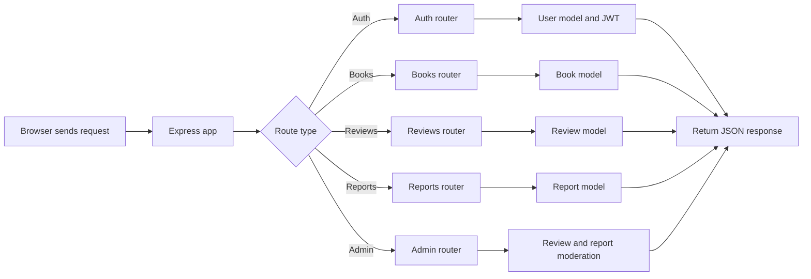

# Backend documentation

## Purpose

The server provides the API for authentication, book lookup, reviews, reporting, and admin moderation.

## Entry point

### server/server.js
- Loads environment variables with dotenv.
- Initializes Express and Mongoose.
- Configures CORS, JSON parsing, static file serving, and Passport.
- Mounts the API routes under /api.
- Starts the HTTP server after the MongoDB connection is ready.

## Authentication and middleware

### server/middleware/auth.js
- Verifies JWT tokens from the Authorization header.
- Provides adminOnly() so admin-only routes can reject non-admin users.

### server/routes/auth.js
- Handles register, login, and Google OAuth login.
- Creates or updates user records in MongoDB.
- Returns a JWT for the frontend to store locally.

## Book endpoints

### server/routes/books.js
- Supports searching books by title or author.
- Returns a limited set of books sorted alphabetically.
- Includes a lookup route by cover image name.

## Reviews and reports

### server/routes/reviews.js
- Lists reviews for a specific book.
- Lets signed-in users create, delete, and fetch their own reviews.

### server/routes/reports.js
- Lets signed-in users report a review.
- Prevents duplicate reports from the same user.

### server/routes/admin.js
- Exposes admin-only routes for listing reports.
- Allows administrators to resolve or dismiss reports and remove the related review.

## Flow

## Notes

- The API uses JSON responses and standard HTTP status codes.
- Authentication is token-based and is enforced on protected routes.
- The admin workflow is intentionally simple and centered around review moderation.
