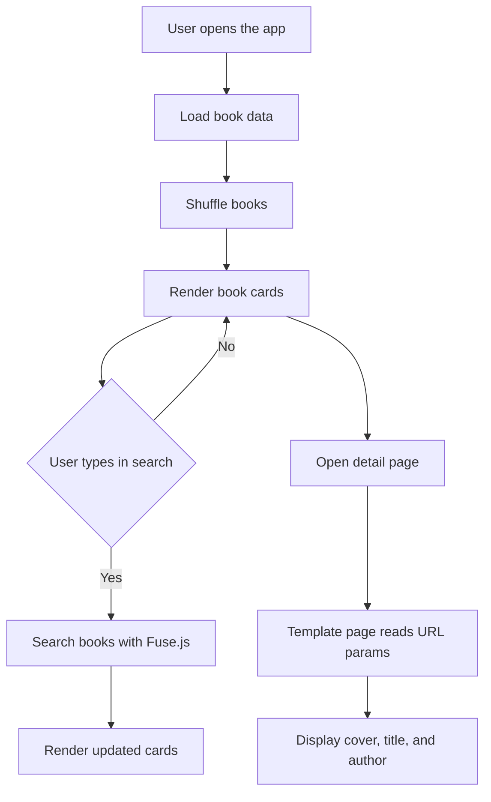

# Frontend documentation

## Purpose

The browser-side code is responsible for showing the book catalog, handling search interactions, rendering the cards, and keeping the authentication state in sync with the API.

## Core files

### src/init.js
- Runs once when the app loads.
- Uses the Fisher-Yates shuffle helper to randomize the book list.
- Calls renderBooks() to populate the main grid.

### src/state.js
- Stores shared references to the card grid, search input, and the Fuse.js instance.
- This keeps the search logic and the render logic connected to the same DOM elements.

### src/onSearch.js
- Reads the current search query.
- Uses Fuse.js to find matching books when the user types.
- Calls renderBooks() with either the filtered results or the full book list.

### src/renderBooks.js
- Builds the HTML for each book card.
- Links each card to template.html with query parameters for the cover, title, and author.

### src/searchEventHandlers.js
- Attaches the input event listener to the search box.
- This makes the search UI respond as soon as the user types.

### src/nav.js
- Renders the authentication navigation area.
- Shows admin links for administrators and profile/logout links for signed-in users.

### src/auth.js
- Stores the JWT and user details in localStorage.
- Provides helpers for reading, saving, and clearing auth data.
- Wraps fetch calls with the Authorization header when a token exists.

## Flow

## Notes

- The frontend is intentionally lightweight and relies on vanilla JavaScript plus a small amount of DOM manipulation.
- The main UI state is not a framework state store; it is mostly driven by the DOM and a few shared references.
