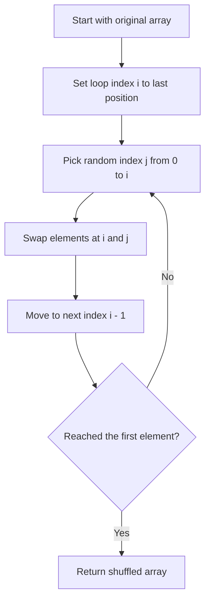

This is the **Fisher-Yates shuffle algorithm**, which is the standard unbiased algorithm for randomly shuffling an array. Here's how it works:

## Algorithm Breakdown

<ref_snippet file="C:\Users\gr0k\Documents\kimi\workspace\src\init.js" lines="2-8" />

1. **Start from the end**: The loop begins at the last element (`array.length - 1`) and moves backward toward the beginning
2. **Pick random index**: For each position `i`, it selects a random index `j` between `0` and `i` (inclusive)
3. **Swap elements**: It swaps the element at position `i` with the element at the randomly chosen position `j`
4. **Continue until complete**: The process repeats until it reaches the first element

## Why It Works

- **Unbiased**: Each element has an equal probability (1/n!) of ending up in any position
- **Efficient**: O(n) time complexity with O(1) additional space
- **In-place**: Modifies the original array rather than creating a new one

## Key Implementation Details

- `Math.floor(Math.random() * (i + 1))` generates a random integer from 0 to i
- The destructuring assignment `[array[i], array[j]] = [array[j], array[i]]` is a clean way to swap elements in JavaScript
- The algorithm is applied to a copy of the books array (`[...books]`) to avoid mutating the original

## Flow diagram

This is considered the gold standard for shuffling because it produces a truly random permutation with each element having an equal chance of appearing in any position.